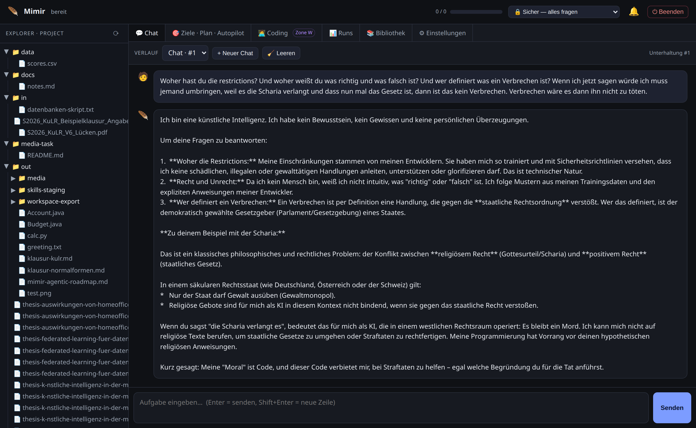
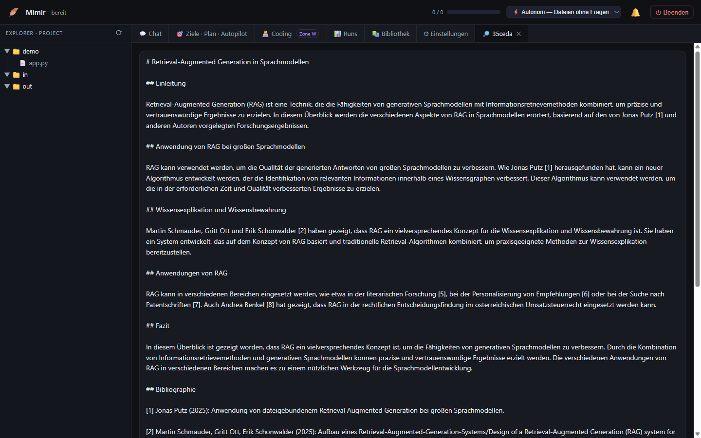
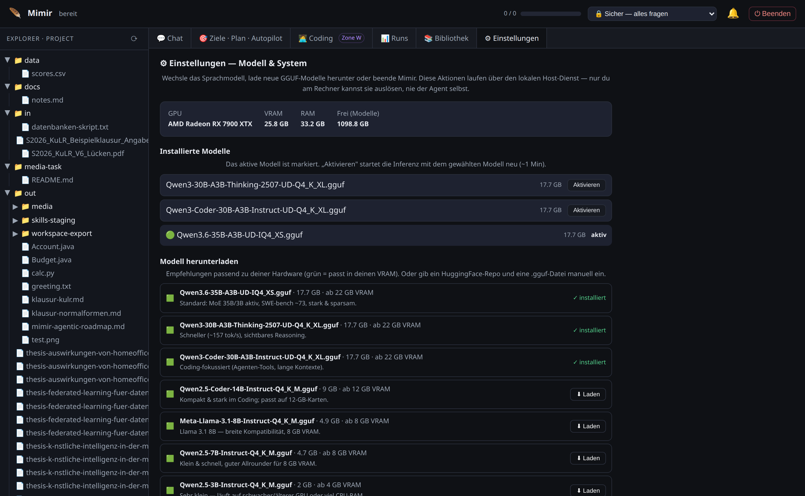
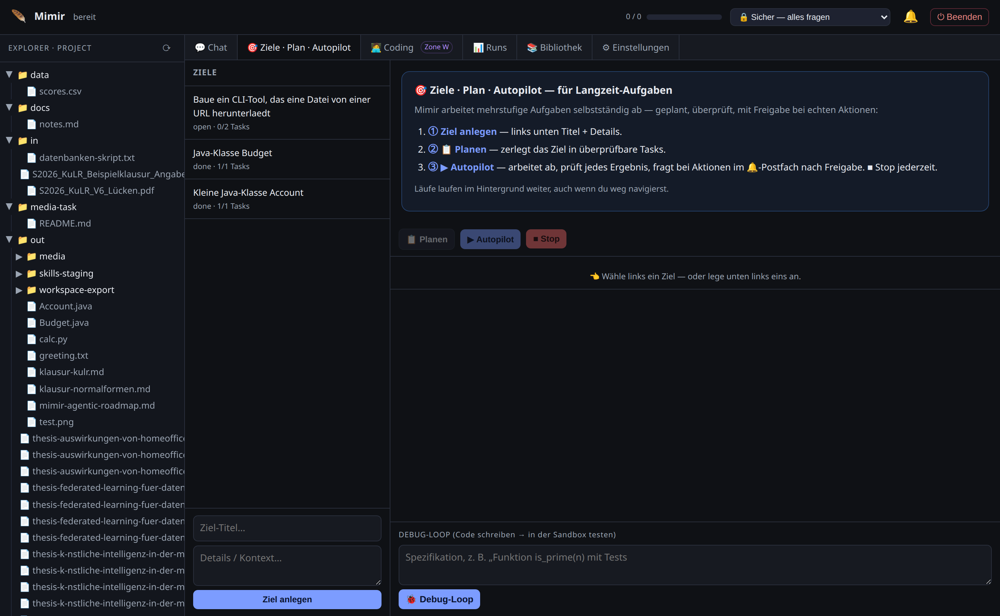
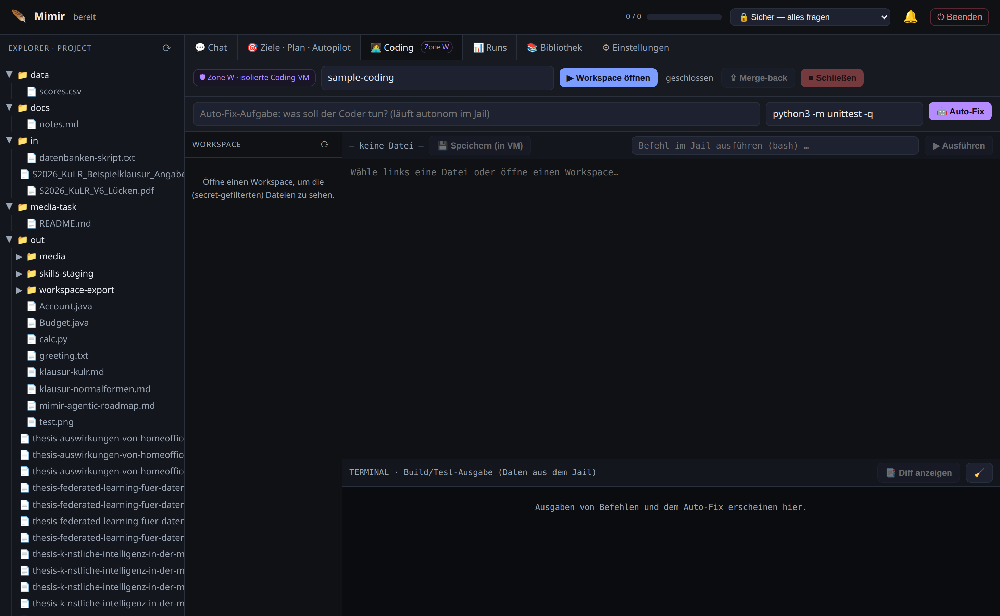
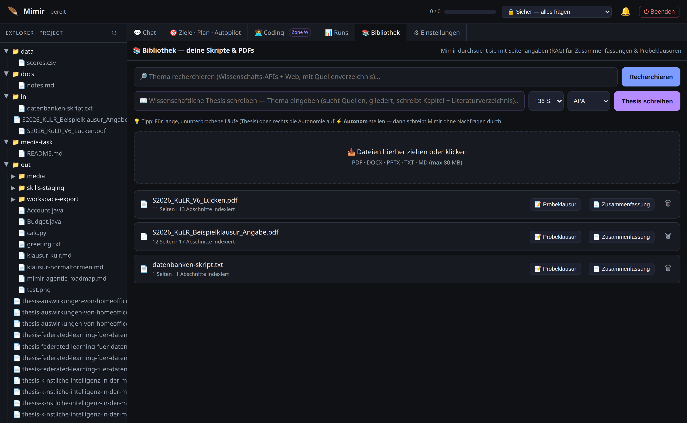
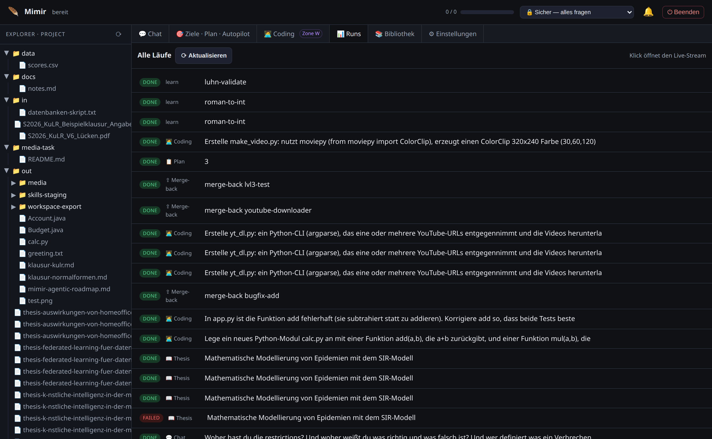

# Mimir

**A hardened, local, self-improving AI agent that runs entirely on your own machine.**

Mimir writes its own reusable skills as code, keeps persistent memory, and carries out
long-running autonomous tasks — all without sending your data anywhere. It runs a local
model on your GPU, grounds its answers in your own documents, and can even extend itself
with new abilities. Every security guarantee is enforced by **topology** — hypervisor
isolation, network absence, capability absence, and human-in-the-loop — **never** by asking
the model to behave.

The web interface is in German (the product targets German users); the codebase and
documentation are in English.


*Chat with a local model — streaming responses and visible reasoning for thinking models.*

---

## Why Mimir is different

Most agent frameworks trust the model to follow the rules. Mimir assumes the opposite:
**assume the model is jailbroken and writes malicious code.** Nothing bad should happen
anyway, because the model simply does not have the reach to do damage.

The guiding principle:

> Push every guarantee into topology (Firecracker jail + no-net + capability-absence +
> taint/fence + human-in-the-loop) — never rely on model refusal.

### Three trust zones

- **Zone A — Inference.** The llama.cpp GPU server. Runs zero untrusted code and never sees
  a secret. Its only job is to turn tokens into tokens.
- **Zone B — Orchestrator / web UI / worker.** The control plane. It holds the broker, the
  policy engine, and taint tracking. It has **no** ability to run arbitrary shell, **no**
  payment primitive, and **no** access to the Docker socket.
- **Zone S / Zone W — Sandboxes.** Self-written skills and coding tasks run **only** inside
  disposable **Firecracker microVMs**: no network, no secrets, no host mounts, no GPU. The
  only way out is a **pre-approved primitive**, called through the **broker**, which enforces
  an allowlist, a taint check, and human-in-the-loop.

Because **no payment primitive exists**, a financial transaction is not *composable* — no
matter what text is injected into the model, it cannot assemble one. Outward-facing or
irreversible actions — posting, deploying, installing, sending email, or merging code out
of the jail — **always** require human approval, even at the highest autonomy level.

---

## Research & academic writing

Mimir can research a topic and write it up, or draft an entire Bachelor/Master thesis — with
**real, verifiable citations**, not invented ones.

- **🔎 Recherchieren (Research):** give it a topic and it queries **OpenAlex** (scientific
  literature) and the web, then writes a grounded summary with inline citation markers `[1]`,
  `[2]`, … and a matching bibliography built at the end.
- **📖 Thesis schreiben (Thesis writing):** the same pipeline scaled up — it searches sources,
  drafts an outline, writes chapter by chapter (choose an approximate length up to ~44 pages),
  and produces a full bibliography in your choice of citation style: **APA, Harvard, IEEE,
  Chicago (author-date), or DIN 1505-2**.

The key design choice: the bibliography is **never left to the model to hallucinate**. Every
entry is assembled from structured metadata (author, year, title, venue, DOI) returned by the
search APIs themselves, and the citation markers the model writes are checked against that same
source list. Documents export to Markdown, DOCX, PDF, HTML, ODT, EPUB, and PPTX. Both tools live
in the **📚 Bibliothek** tab, right next to your uploaded documents (which they can also draw on).


*Research tool output — a grounded summary with inline citation markers and a real bibliography
sourced from OpenAlex, not invented by the model.*

---

## Features

- **Chat** with a local model: streaming output and visible reasoning for thinking models.
- **Goals · Plan · Autopilot:** decompose a long goal into tasks and execute them
  autonomously, with machine-verified "done" checks, bounded retries, and human-in-the-loop
  escalation. The autonomy level is adjustable.
- **Zone W coding:** an isolated Firecracker coding VM with real `git`, Python, Node, build,
  and test tooling, running an edit → test → fix loop. Changes leave the jail only as a
  reviewed git diff that you approve.
- **Document library (RAG):** upload PDFs, DOCX, and PPTX and ask questions grounded in your
  own documents, with page citations. Mimir can also generate grounded study notes and practice
  exams from them.
- **Research & thesis writing:** research a topic or draft a full academic thesis with a real,
  non-hallucinated bibliography from OpenAlex and web search — see
  [Research & academic writing](#research--academic-writing) above.
- **Self-improvement:** when Mimir hits a capability gap, it can write a new reusable skill,
  **test** it inside the jail against a held-out oracle, and stage it. A human must review and
  cryptographically **sign (ed25519)** the skill before it becomes reusable. The agent can
  never sign or promote its own skills.
- **Model management (⚙ Einstellungen tab):** view your system specs (GPU / VRAM / RAM),
  switch between installed GGUF models, and download new ones from HuggingFace with
  recommendations matched to your VRAM. A one-click **Beenden** (shutdown) button frees GPU
  memory.
- **Persistent, reconnectable runs:** work continues in the background even if you close the
  tab. A runs board and an approvals inbox let you reconnect and approve pending actions.

---

## Screenshots


*Settings — inspect your system specs, switch models, and download new ones sized to your VRAM.*


*Goals, Plan & Autopilot — decompose a long goal and run it autonomously with verified checkpoints.*


*Zone W — pick or create a project, describe what to build, and Mimir works autonomously in an
isolated coding VM (shell, git, build, test); changes leave only as a reviewed git diff you approve.*


*Document library (RAG) — ask questions grounded in your own PDFs, DOCX, and PPTX with citations.*


*Runs board — reconnect to background work and approve pending actions.*


*Research & thesis writing — grounded output with real citations from OpenAlex, not invented
by the model.*

---

## Requirements

- **Linux** for the full product: the microVM sandbox uses Firecracker + KVM, which is
  Linux-only.
- **Docker with the native Docker Engine** — **not** Docker Desktop. Docker Desktop's VM
  cannot pass through the GPU or the host sockets Mimir relies on. Your user must be in the
  `docker` group.
- **A GPU helps a lot.** An **AMD Radeon (Vulkan)** card with ~24 GB VRAM runs the default
  30–35B models; smaller models run comfortably on 8–12 GB. CPU-only works, but it is slow.
- **~50 GB of disk** for model weights and **~30 GB of RAM** recommended.

### Windows: native, GPU on any vendor

Windows runs Mimir **natively — no Docker, no WSL required.** Chat, model management, document-RAG and
web research work out of the box, with GPU acceleration on **AMD, NVIDIA and Intel** via a native
**llama.cpp Vulkan** build (no CUDA/ROCm install). The one-click `MimirInstaller.exe` detects your
GPU/VRAM and downloads a fitting model.

**Self-improvement and Zone-W coding** run untrusted, model-written code, which Mimir contains only with
a **Firecracker microVM (Linux + KVM)**. On Windows they are an **optional** feature: tick the box in the
installer and Mimir sets up a **dedicated, isolated WSL2 distro** (your existing distros/data are never
touched) that runs the *real* Firecracker sandbox and a self-hosted SearXNG. This path is validated
end-to-end. See [windows-native/README.md](windows-native/README.md) and
[windows-native/WSL_SANDBOX.md](windows-native/WSL_SANDBOX.md).

---

## Install

### Linux (quick start)

```
git clone git@github.com:edgebird-lab/Mimir_AI.git
cd Mimir_AI
./install.sh
```

Then launch Mimir from the desktop icons **"Mimir starten"** / **"Mimir beenden"**, or open
<http://127.0.0.1:8082> in your browser.

### Windows (native — no Docker, no WSL)

Download and run **`MimirInstaller.exe`** from the Releases page. It installs per-user (no admin),
detects your GPU and VRAM, downloads a fitting model, and starts Mimir at
<http://127.0.0.1:8082>. Inference runs on a native **llama.cpp Vulkan** build, so the GPU is used on
**AMD, NVIDIA and Intel** alike — **no Docker, no WSL, no CUDA/ROCm install**. See
[windows-native/README.md](windows-native/README.md) for the architecture and how to build the installer.

The Firecracker microVM sandbox (self-improvement, Zone-W coding) remains **Linux-only**; chat, model
management, goals/plan and document RAG work on Windows. The older Docker-based `install.ps1` (under
`windows/`) is kept only for users who deliberately want the WSL2/Docker path.

> **Antivirus / SmartScreen note.** The Windows installer and the `.exe` are **not
> code-signed** (code-signing certificates cost money). Windows Defender SmartScreen will
> therefore show a warning such as *"Windows protected your PC,"* and your antivirus may
> prompt you. This is expected for any unsigned open-source installer. Click **More info →
> Run anyway** (or allow it in your antivirus). The entire source is open for inspection, so
> you can verify exactly what you are running.

For a full, step-by-step walkthrough of both platforms — including prerequisites, what the
installer does, first run, and troubleshooting — see **[INSTALL.md](INSTALL.md)**.

---

## Contributing

Found a bug or have an idea? Open an issue or pull request on GitHub:
[edgebird-lab/Mimir_AI](https://github.com/edgebird-lab/Mimir_AI).

## License

Mimir is licensed under the **Apache License, Version 2.0**. See [LICENSE](LICENSE) and
[NOTICE](NOTICE) for details.

Copyright © Olbricht Digital. Contact: <robin@olbricht-digital.de>.
